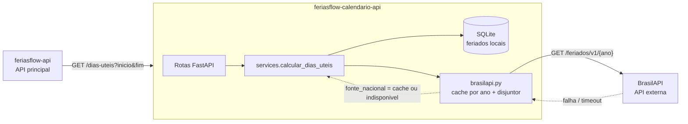

# FeriasFlow - Calendario API

API **secundaria** do MVP da Sprint *Arquitetura de Software* (pos-graduacao em Engenharia de
Software, PUC-Rio). Servico de calendario de trabalho: cadastra **feriados locais**, consulta os
**feriados nacionais** na [BrasilAPI](https://brasilapi.com.br) e conta os **dias uteis** de um
periodo. E consumida pela API principal
[`feriasflow-api`](https://github.com/FSEB-SW/feriasflow-api), que gerencia pedidos de ferias.

| Componente | Repositorio | Papel |
|---|---|---|
| API principal | [FSEB-SW/feriasflow-api](https://github.com/FSEB-SW/feriasflow-api) | pedidos de ferias, colaboradores, decisao do gestor; `docker-compose.yml` |
| API secundaria | **este repositorio** | feriados locais + dias uteis |
| API externa | [BrasilAPI - Feriados Nacionais](https://brasilapi.com.br/docs#tag/Feriados-Nacionais) | `GET /feriados/v1/{ano}`, publica e gratuita, sem cadastro |

Aluno: Julio Frois. Continuidade do produto **FeriasFlow** idealizado na Sprint de Gestao Agil
([FSEB-SW/ferias-flow-mvp](https://github.com/FSEB-SW/ferias-flow-mvp)).

## Por que um servico separado

O dominio "calendario de trabalho" tem **coesao propria** (feriados, dias uteis) e **ciclo de vida
independente** do dominio "pedido de ferias": o RH atualiza feriados uma vez por ano; pedidos mudam
todo dia. Separar da a API principal um consumidor claro (`GET /dias-uteis`) e isola a dependencia
externa (BrasilAPI) num unico lugar, com cache e disjuntor. O trade-off (um salto de rede a mais,
dois deploys) esta registrado no README da API principal, em *Decisoes de arquitetura*.

## Fluxo



Se a BrasilAPI falhar, a resposta continua **200** com `fonte_nacional: "indisponivel"` e um
`aviso`: o servico degrada de forma controlada em vez de derrubar quem depende dele. Apos 3 falhas
seguidas o disjuntor abre por 60 s e o servico para de insistir na fonte externa.

## Rotas

| Metodo | Rota | Descricao |
|---|---|---|
| GET | `/feriados?ano=` | lista feriados locais (filtro opcional por ano) |
| GET | `/feriados/{id}` | obtem um feriado |
| POST | `/feriados` | cadastra feriado local (`data`, `nome`, `tipo` = municipal, estadual ou empresa) |
| PUT | `/feriados/{id}` | atualiza (parcial) |
| DELETE | `/feriados/{id}` | remove |
| GET | `/dias-uteis?inicio=&fim=` | dias corridos, fins de semana, feriados (locais + nacionais) e dias uteis |
| GET | `/feriados-nacionais/{ano}` | repasse dos feriados nacionais da BrasilAPI |
| GET | `/health` | estado do servico, do banco e da BrasilAPI |

Documentacao interativa (Swagger): `http://localhost:8001/docs`. Codigos: 201 criado, 204 removido,
404 nao encontrado, 409 data ja cadastrada, 422 entrada invalida.

Exemplo:

```
GET /dias-uteis?inicio=2026-09-01&fim=2026-09-30
{
  "inicio": "2026-09-01", "fim": "2026-09-30",
  "dias_corridos": 30, "dias_uteis": 21, "fins_de_semana": 8,
  "feriados": [{"data": "2026-09-07", "nome": "Independencia do Brasil", "origem": "nacional"}],
  "fonte_nacional": "brasilapi", "aviso": null
}
```

## API externa: BrasilAPI

- Endpoint: `https://brasilapi.com.br/api/feriados/v1/{ano}`; sem autenticacao, sem custo, licenca MIT.
- Documentacao: <https://brasilapi.com.br/docs#tag/Feriados-Nacionais>.
- Resposta: `[{"date": "2026-04-21", "name": "Tiradentes", "type": "national"}, ...]`.
- Uso aqui: `app/brasilapi.py` consulta por ano, guarda em cache (24 h) e aplica timeout de 5 s.
  Configuravel por `BRASILAPI_URL`, `BRASILAPI_TIMEOUT`, `BRASILAPI_CACHE_TTL`,
  `BRASILAPI_FALHAS_PARA_ABRIR`, `BRASILAPI_TEMPO_ABERTO`.

## Como executar

Com Docker (recomendado):

```bash
docker build -t feriasflow-calendario-api .
docker run --rm -p 8001:8000 -v feriasflow_calendario:/app/data feriasflow-calendario-api
```

Acesse `http://localhost:8001/docs`. O volume guarda o SQLite entre execucoes. Para subir os dois
servicos juntos use o `docker-compose.yml` da API principal.

Sem Docker (Python 3.12):

```bash
python -m venv .venv && .venv\Scripts\activate    # Windows; no Linux: source .venv/bin/activate
pip install -r requirements.txt
uvicorn app.main:app --reload --port 8001
```

Variaveis: `DATABASE_URL` (padrao `sqlite:///./data/calendario.db`).

## Testes

```bash
pip install -r requirements-dev.txt
pytest -q
```

Vinte testes, sem rede (a BrasilAPI e simulada com `httpx.MockTransport`):

- CRUD de feriados (201/200/204/404/409/422);
- contagem de dias uteis com fim de semana, feriado nacional, feriado local e virada de ano;
- cache, degradacao com a BrasilAPI fora e abertura do disjuntor;
- **teste de contrato** (`tests/test_contrato.py`): a resposta de `/dias-uteis` e validada contra
  `contratos/dias-uteis.schema.json`, o mesmo arquivo que o consumidor (`feriasflow-api`) usa do
  lado dele. Quem mudar o formato quebra o teste antes de quebrar o consumidor.

## Pipeline (GitHub Actions)

`.github/workflows/ci.yml`: a cada push ou pull request roda `pytest`, constroi a imagem Docker e
sobe o container para conferir o `/health` (smoke test). Entrega por pull request.

## Estrutura

```
app/
  main.py          aplicacao FastAPI e rotas montadas
  config.py        variaveis de ambiente
  database.py      engine/sessao SQLAlchemy (SQLite)
  models.py        agregado Feriado
  schemas.py       contratos Pydantic de entrada/saida
  brasilapi.py     cliente da API externa (cache + disjuntor)
  services.py      calculo de dias uteis
  routers/         feriados.py, calendario.py, health.py
contratos/         dias-uteis.schema.json (contrato compartilhado com o consumidor)
tests/             pytest (fixtures sem rede)
Dockerfile         imagem python:3.12-slim, usuario sem privilegio, HEALTHCHECK
```
